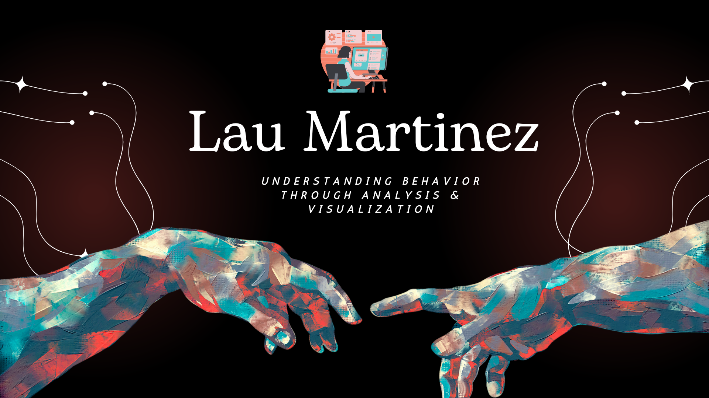

  </a>

<h3 align="center">
Hi there, I'm Lau 👋
</h3>

<h2 align="center">
I'm a behavioral scientist 💻 with a passion for research and data analysis. 
</h2> 

I love the entire process of analizing complex data. I love the challenge of finding hidden patterns and solve different kind of problems.

### 🤝 Connect with me:

- 💬 If you have any questions or feedback, please feel free to reach out to me!

## 🔭 I'm currently working on

    - Conducting a research in the field of Fatigue and Sleep (Stay tuned for updates...)
    - Engaging in Kaggle and Udemy projects to improve my analytical skills
    - Pursuing personal projects that push the boundaries of innovation
    - Crafting my next enlightening blog post
    - Sharpening my expertise in Python and machine learning techniques
    
## 🌱 I'm currently learning

- 📱
- I’m currently learning everything 🤣
- 🌱 Python and machine learning: Advancing my proficiency in advanced algorithms and predictive modeling.
- ⚡ Fun fact: I love learning to play guitar

## 💼 Technical Skills

 

 

## 📝 Latest Blog Posts

- [soon]

